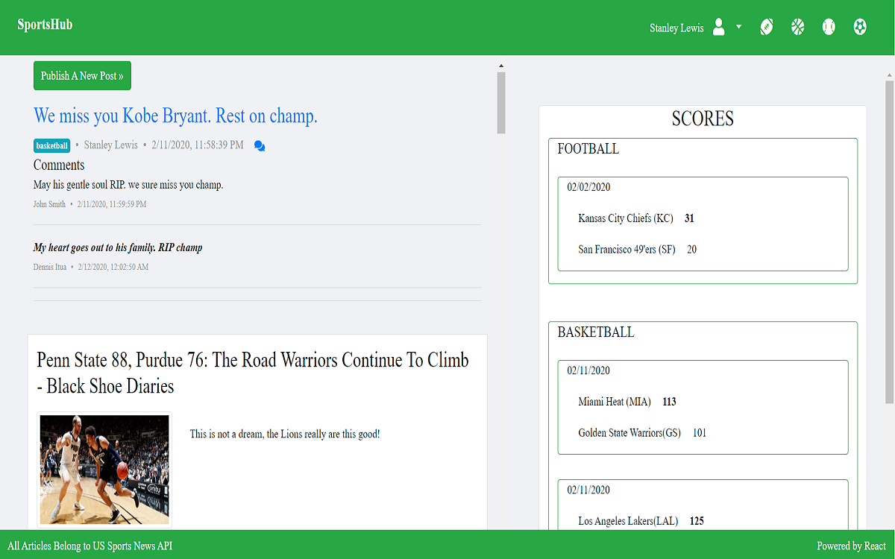

## SportsHub

### MERN Stack Aplication

### About app

- A sports news and discussion app that combines the best aspects of media outlets such as ESPN as well as community discussion services such as Reddit. This app provides live scores for several different sports, updated news articles, and a place for users to create and comment on sports related content.

- Full-Stack App that includes user log-in funcationality, api calls, database storage, dom manipulation, and more

### Technolgies

- ReactJS

- MongoDB/Mongoose

- ExpressJS

- NodeJS

- Javascript / (ES6)

- HTML5

- CSS3

- Heroku (for deployment)

- AJAX

- Bootstrap4

- Font Awesome

- trix rich text editor

### Dependencies

- Lodash / Mongoose / Redux / Passport-jwt / bcrypt-nodejs /  if-env / axios /     prop-types / react-router-dom / morgan / nodemon / concurrently / cors / redux-form

Click on image below to view app on heroku......

